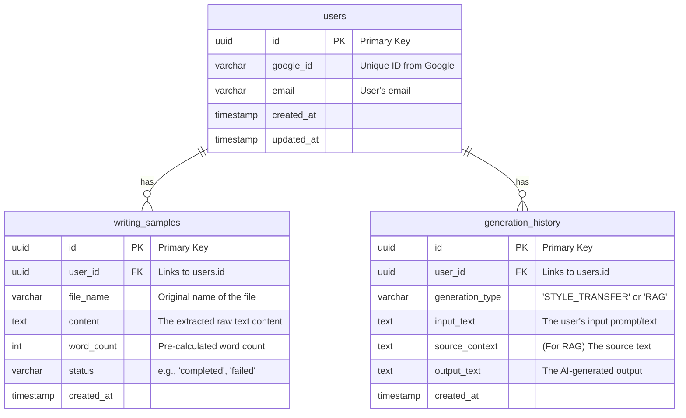

A well-designed schema is crucial for a scalable and maintainable application. Based on our PRD, the data model is straightforward. We primarily need to track users, the writing samples they upload to define their style, and potentially the history of their generated content.

Here is a proposed schema using standard conventions. I'll use UUIDs for primary keys as a modern best practice to prevent enumeration attacks and simplify distributed systems later.

-----

### Database Schema - V1

We'll design three core tables: `users`, `writing_samples`, and `generation_history`.

#### Table Relationships

The relationships are simple one-to-many:

  * A `user` can have many `writing_samples`.
  * A `user` can have many `generation_history` records.

<!-- end list -->

### Table Definitions

#### 1\. `users`

This table stores the essential information for each registered user, linked to their Google account.

| Column Name  | Data Type | Constraints/Notes                                  |
| :----------- | :-------- | :------------------------------------------------- |
| `id`         | `UUID`    | **Primary Key**. A unique identifier for the user. |
| `google_id`  | `VARCHAR` | **`UNIQUE`**, **`NOT NULL`**. The user ID from Google Auth. |
| `email`      | `VARCHAR` | **`UNIQUE`**, **`NOT NULL`**. User's email, for reference. |
| `created_at` | `TIMESTAMP`| Automatically set on creation.                     |
| `updated_at` | `TIMESTAMP`| Automatically updated on any change.               |

#### 2\. `writing_samples`

This table holds the extracted text from the documents each user uploads to define their style.

| Column Name  | Data Type | Constraints/Notes                                  |
| :----------- | :-------- | :------------------------------------------------- |
| `id`         | `UUID`    | **Primary Key**.                                   |
| `user_id`    | `UUID`    | **Foreign Key** to `users.id`. **`NOT NULL`**.      |
| `file_name`  | `VARCHAR` | The original name of the uploaded file. Optional.  |
| `content`    | `TEXT`    | **`NOT NULL`**. The full, extracted text of the sample. |
| `word_count` | `INTEGER` | **`NOT NULL`**. We'll calculate this on the backend after upload. |
| `status`     | `VARCHAR` | For future use: 'completed', 'failed'. Defaults to 'completed'. |
| `created_at` | `TIMESTAMP`| Automatically set on creation.                     |

#### 3\. `generation_history`

This table is for the "Should-have" feature of keeping a log of recent generations for the user. It's smart to design it now.

| Column Name       | Data Type | Constraints/Notes                                  |
| :--------------   | :-------- | :------------------------------------------------- |
| `id`              | `UUID`    | **Primary Key**.                                   |
| `user_id`         | `UUID`    | **Foreign Key** to `users.id`. **`NOT NULL`**.      |
| `generation_type` | `VARCHAR` | **`NOT NULL`**. 'STYLE\_TRANSFER' or 'RAG'. An `ENUM` type is also great here. |
| `input_text`      | `TEXT`    | The user's prompt or the text they wanted to transfer. |
| `source_context`  | `TEXT`    | **`NULLABLE`**. For RAG, this stores the source text used. |
| `output_text`     | `TEXT`    | The final text generated by the AI.                |
| `created_at`      | `TIMESTAMP`| Automatically set on creation.                     |

-----

This schema provides a solid foundation for all the features listed in our PRD. It's normalized, scalable, and directly supports the core logic of our application.
